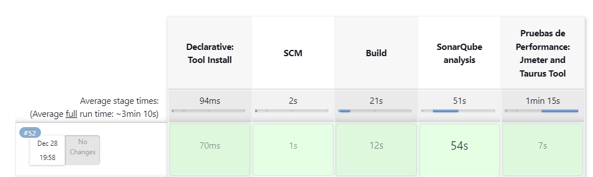
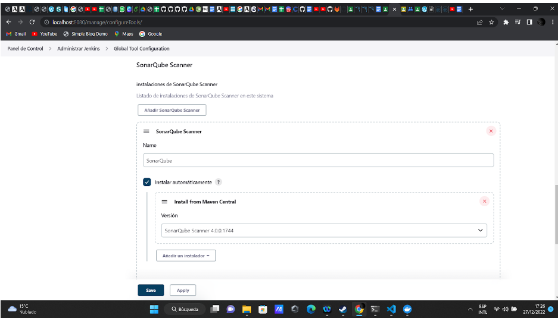
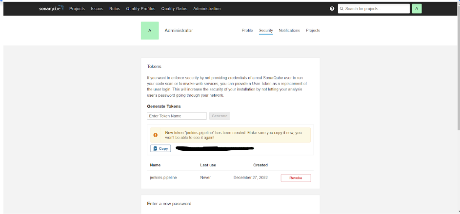
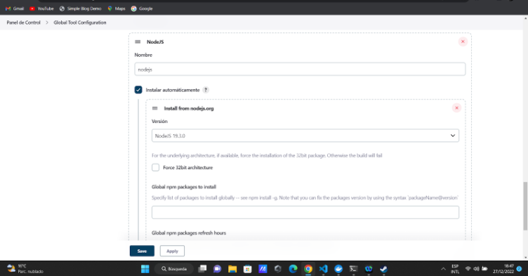

# IS_II_Proyecto_Final

Integrantes:
- Rivas Huanca Diego Raul
- Marko Marcelo Ituccayasi Umeres
- Jeremy Manuel Alvarez Astete 
- Anagabriela Pilar Jimenez Lopez
- Sennayda Sadid Rimache Choquehuanca


## [Pipeline de CI/CD](jenkinsfile)

#### Requisitos

:heavy_check_mark: Jenkins Plugins
* [PipeLine](https://plugins.jenkins.io/workflow-aggregator/)
* [Jenkins NodeJS plugin v14.8](https://plugins.jenkins.io/git-parameter/)
* [Jenkins BlueOcean](https://plugins.jenkins.io/blueocean/)
* [Git Parameter](https://plugins.jenkins.io/git-parameter/)
* [SonarQube Scanner](https://plugins.jenkins.io/sonar/)

:heavy_check_mark: SonarQube

:heavy_check_mark: SonarScanner

### Pipeline 




### Reporte Sonar Scanner


# Construccion Automatica
Para la construcción automática nos apoyaremos en **Webpack**.

## Instalación
Seguiremos los siguientes pasos para la instalacion de Webpack y las dependencias necesarias para el proyecto.
```
mkdir x-spreadsheet && cd x-spreadsheet
npm init -y
npm install webpack webpack-cli --save-dev

mkdir dist src
touch webpack.config.js


npm install --save-dev file-loader css-loader file-loader
npm install --save-dev html-webpack-plugin
npm install --save-dev clean-webpack-plugin
npm install --save-dev webpack-dev-server
npm install --save-dev webpack-merge

# less
npm install less --save-dev
npm install less-loader --save-dev

npm install eslint --save-dev
./node_modules/.bin/eslint --init # airbnb
```
## Configuración
En el archivo **package.json** añadimos el *script* correspondiente para poder ejecutar la construccion automatica .
- **dev:** Para el modo de desarrollo
- **build:** Para el modo de produccion

```
"scripts": {
	"dev": "webpack-dev-server --open --config build/webpack.dev.js",
    "build": "webpack --config build/webpack.prod.js",
}
```
## Ejecución
Para la construcción automática  del modo de desarrollo usamos el comando :

```
npm run dev

```
Para la construcción automática  del modo de produccion usamos el comando :

```
npm run build

```


# Integración del SonarQube en Jenkins
Primero instalamos SonarQube for Jenkins desde el Gestor del plugin.


Despues generamos un token desde SonarQube para jenkins.
<br>

Despues agregamos el token para SonarQube Servers.           


## Instalar NodeJs
Configuramos.                                          


# Integración de Jmeter en Jenkins
Crear un archivo jmx con las pruebas y guardarlo en jmeter/test_is_final.jmx.
Y finalmente ejecutarlo desde jenkins.

## Code Smells
## Expected a `for-of` loop instead of a `for` loop with this simple iteration.
Si tiene un iterable, como una matriz, conjunto o lista, su mejor opción para recorrer sus valores es la sintaxis for que itere entre esas variables. Usando un contador obtendrá mismo comportamiento, pero el código no será tan limpio o claro.

<p align="center">
    
</p>

### Refactor this function to reduce its Cognitive Complexity from 20 to the 15 allowed.
La complejidad cognitiva es una medida de qué tan difícil es comprender el flujo de control de una función. Las funciones con alta complejidad cognitiva serán difíciles de mantener.
<p align="center">
    
</p>
<p align="center">
    
</p>
before
<p align="center">
    
</p>

after
<p align="center">
    
</p>

## Refactoring code smells
### Expected a `for-of` loop instead of a `for` loop with this simple iteration.

<p align="center">
    
</p>


### COMPOSING METHODS:  5. Introduce Explaining Variable
before
<p align="center">
    
</p>
after
<p align="center">
    
</p>

### FUNCTIONS SHOULD NOT BE EMPTY
Hay varias razones para que una función no tenga un cuerpo de función:
- Es una omisión involuntaria y debe corregirse para evitar un comportamiento inesperado en la producción.
- Aún no se admite, o nunca lo será. En este caso, debería lanzarse una excepción en los idiomas donde ese mecanismo está disponible.
- El método es una anulación intencionalmente en blanco. En este caso, un comentario anidado debería explicar el motivo de la anulación en blanco.

Solucion de compilacion
<p align="center">
    
</p>
Ejemplos:

- Before arrow function
<p align="center">
    
</p>

- After arrow function
<p align="center">
    
</p>

- Before method
<p align="center">
    
</p>

- After method
<p align="center">
    
</p>


