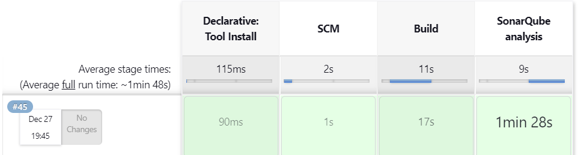
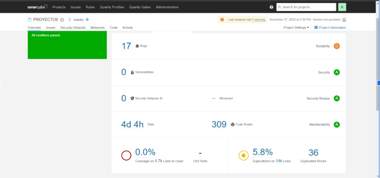

# IS_II_Proyecto_Final

Integrantes:
- Rivas Huanca Diego Raul
- Marko Marcelo Ituccayasi Umeres
- Jeremy Manuel Alvarez Astete 
- Ana Grabriela Pilar Jimenez Lopez
- Senayda


## [Pipeline de CI/CD](jenkinsfile)

#### Requisitos

:heavy_check_mark: Jenkins Plugins
* [PipeLine](https://plugins.jenkins.io/workflow-aggregator/)
* [Jenkins NodeJS plugin v14.8](https://plugins.jenkins.io/git-parameter/)
* [Jenkins BlueOcean](https://plugins.jenkins.io/blueocean/)
* [Git Parameter](https://plugins.jenkins.io/git-parameter/)
* [SonarQube Scanner](https://plugins.jenkins.io/sonar/)

:heavy_check_mark: SonarQube

:heavy_check_mark: SonarScanner

### Pipeline 



### Reporte Sonar Scanner



# Construccion Automatica
Para la construcción automática nos apoyaremos en **Webpack**.

## Instalación
Seguiremos los siguientes pasos para la instalacion de Webpack y las dependencias necesarias para el proyecto.
```
mkdir x-spreadsheet && cd x-spreadsheet
npm init -y
npm install webpack webpack-cli --save-dev

mkdir dist src
touch webpack.config.js


npm install --save-dev file-loader css-loader file-loader
npm install --save-dev html-webpack-plugin
npm install --save-dev clean-webpack-plugin
npm install --save-dev webpack-dev-server
npm install --save-dev webpack-merge

# less
npm install less --save-dev
npm install less-loader --save-dev

npm install eslint --save-dev
./node_modules/.bin/eslint --init # airbnb


# test mocha
npm install --save-dev mocha

# babel
npm install --save-dev babel-loader babel-core babel-preset-env
# for macha
npm install --save-dev babel-register
# npm install --save-dev babel-plugin-transform-runtime
# npm install --save babel-runtime
```
